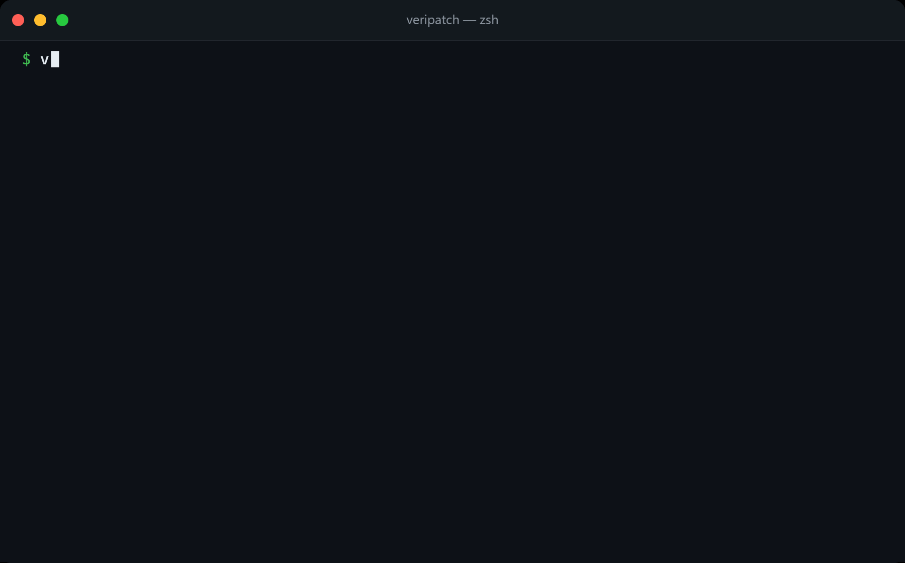

# 🛡️ VeriPatch

### **Don't just detect vulnerabilities. Prove the fix is safe.**

> **Verified remediation for npm vulnerabilities — from detection to evidence.**

[](https://github.com/amarjaleelbanbhan/VeriPatch/actions/workflows/ci.yml)
[](https://www.npmjs.com/package/veripatch)
[](https://www.npmjs.com/package/veripatch)
[](LICENSE)

<br />



<p align="center">
  <strong>Scan → Verify → Prove → Report</strong>
</p>

---

## 🚨 The Problem

Modern security tools are excellent at **finding vulnerabilities**.

But finding a vulnerability is only the beginning.

The real question is:

> **"If I apply this fix, can I prove that the vulnerability is gone — and that my application still works?"**

Engineers often hesitate to remediate vulnerabilities because of:

* 🔔 Alert fatigue
* 💥 Fear of breaking production
* 🔄 Dependency conflicts
* 🧪 Lack of verification
* 📄 Lack of auditable evidence

Tools like `npm audit`, Dependabot, and Snyk help identify problems.

**VeriPatch focuses on what happens next.**

---

# 💡 What is VeriPatch?

**VeriPatch is a verification-first vulnerability remediation tool for npm projects.**

Instead of simply telling you:

> ❌ "A vulnerability exists."

VeriPatch aims to tell you:

> ✅ "We applied the fix in isolation."
> ✅ "We independently verified the vulnerability is no longer present."
> ✅ "Your build and tests still pass."
> ✅ "Here is the evidence."

### The workflow

```text
┌──────────┐
│   SCAN   │
└────┬─────┘
     │
     ▼
┌──────────┐
│  RANK    │  Severity × Fix Feasibility
└────┬─────┘
     │
     ▼
┌──────────┐
│  VERIFY  │  Hardened Docker Sandbox
└────┬─────┘
     │
     ├───────────────┐
     ▼               ▼
 Re-scan          Build + Test
     │               │
     └───────┬───────┘
             ▼
      ┌─────────────┐
      │   REPORT    │
      └─────────────┘
             │
             ▼
      📄 Audit Evidence
```

---

# ⚡ Why VeriPatch?

| Capability                     | `npm audit` | Dependabot | Snyk | **VeriPatch** |
| ------------------------------ | :---------: | :--------: | :--: | :-----------: |
| Detect known vulnerabilities   |      ✅      |      ✅     |   ✅  |       ✅       |
| Severity ranking               |      ✅      |      ✅     |   ✅  |       ✅       |
| Opens a fix PR                 |      ❌      |      ✅     |   ✅  |       ❌       |
| Runs the fix in isolation      |      ❌      |      ❌     |   ❌  |     **✅**     |
| Re-scans after remediation     |      ❌      |      ❌     |   ❌  |     **✅**     |
| Verifies vulnerability is gone |      ❌      |      ❌     |   ❌  |     **✅**     |
| Runs real build & tests        |      ❌      |      ❌     |   ❌  |     **✅**     |
| Deterministic verdicts         |      ❌      |      ❌     |   ❌  |     **✅**     |
| Self-hosted                    |      ✅      |      ✅     |   ❌  |     **✅**     |
| No account required            |      ✅      |      ✅     |   ❌  |     **✅**     |

> **Detection tells you there is a problem.
> Verification gives you evidence that the problem is actually solved.**

---

# 🔬 How VeriPatch Works

### 1️⃣ Scan

Parse your project's dependency lockfile and query vulnerability intelligence from [OSV.dev](https://osv.dev).

VeriPatch ranks vulnerabilities based on:

```text
Severity × Fix Feasibility
```

Giving developers a prioritized remediation queue instead of an overwhelming list of alerts.

---

### 2️⃣ Verify

VeriPatch creates an isolated copy of your project and performs the remediation inside a hardened Docker sandbox.

```text
Your Project
     │
     ▼
┌─────────────────────┐
│   Isolated Copy     │
│                     │
│  Apply Dependency   │
│       Fix           │
│         │           │
│         ▼           │
│   Install Safely    │
│         │           │
│         ▼           │
│    Re-scan Tree     │
│         │           │
│         ▼           │
│    Build + Test     │
└─────────────────────┘
```

The original working tree remains untouched during verification.

---

### 3️⃣ Prove

VeriPatch independently re-scans the resolved dependency tree.

The goal is not to assume the fix worked.

The goal is to **prove the vulnerable dependency is no longer present**.

Verification decisions are based on:

* Exit codes
* Independent vulnerability re-scan
* Build results
* Test results

**No log-text heuristics.**

---

### 4️⃣ Report

Every verification can produce machine-readable and human-readable evidence.

```text
📄 report.md
📦 report.json
```

Reports can capture:

* Vulnerability identity
* Original dependency state
* Applied remediation
* Verification results
* Re-scan results
* Build status
* Test status 001
* Final confidence verdict

This makes remediation easier to review, automate, and audit.

---

# 🚀 Quickstart

### Install

```bash
npm install -g veripatch
```

### Diagnose your environment

```bash
veripatch doctor
```

Checks:

* Node.js
* Docker
* Lockfile
* Network connectivity
* Environment readiness

### Scan your project

```bash
veripatch scan
```

Get a ranked vulnerability report in seconds.

### Verify a vulnerability fix

```bash
veripatch verify GHSA-...
```

Test the remediation inside an isolated sandbox.

### Apply a verified fix

```bash
veripatch update GHSA-...
```

Apply the remediation to your working tree.

### Re-render evidence

```bash
veripatch report GHSA-...
```

Generate the report again without repeating the verification process.

---

# 🤖 GitHub Actions

Bring verified remediation directly into your CI pipeline.

```yaml
- uses: actions/checkout@v4

- uses: amarjaleelbanbhan/VeriPatch@v0.1.0
  with:
    severity-threshold: high
    fail-on: new
```

Full workflow example:

👉 [examples/workflow.yml](examples/workflow.yml)

All available Action inputs:

👉 [action.yml](action.yml)

---

# 📦 Supported Lockfiles

VeriPatch automatically detects:

| Package Manager              | Scan | Verify / Update |
| ---------------------------- | :--: | :-------------: |
| npm / `package-lock.json` v2 |   ✅  |        ✅        |
| npm / `package-lock.json` v3 |   ✅  |        ✅        |
| Yarn Classic                 |   ✅  |        🚧       |
| Yarn Berry                   |   ✅  |        🚧       |
| pnpm v6                      |   ✅  |        🚧       |
| pnpm v9                      |   ✅  |        🚧       |

> `verify` and `update` currently replay fixes with npm. Yarn and pnpm projects are explicitly refused rather than risking lockfile corruption.

---

# 🏗️ Architecture

```text
                         ┌──────────────────┐
                         │     Developer    │
                         └────────┬─────────┘
                                  │
                                  ▼
                         ┌──────────────────┐
                         │  VeriPatch CLI   │
                         └────────┬─────────┘
                                  │
                    ┌─────────────┴─────────────┐
                    │                           │
                    ▼                           ▼
             ┌─────────────┐             ┌─────────────┐
             │    SCAN     │             │   VERIFY    │
             └──────┬──────┘             └──────┬──────┘
                    │                           │
                    ▼                           ▼
             ┌─────────────┐             ┌─────────────┐
             │ Lockfile    │             │ Docker      │
             │ Parser      │             │ Sandbox     │
             └──────┬──────┘             └──────┬──────┘
                    │                           │
                    ▼                           ▼
             ┌─────────────┐             ┌─────────────┐
             │   OSV.dev   │             │ Apply Fix   │
             └──────┬──────┘             └──────┬──────┘
                    │                           │
                    ▼                           ▼
             ┌─────────────┐             ┌─────────────┐
             │ Rule Engine │             │ Re-scan     │
             └──────┬──────┘             └──────┬──────┘
                    │                           │
                    └─────────────┬─────────────┘
                                  │
                                  ▼
                         ┌──────────────────┐
                         │ Evidence Report  │
                         │   MD + JSON      │
                         └──────────────────┘
```

See the full architecture:

👉 [docs/ARCHITECTURE.md](docs/ARCHITECTURE.md)

---

# 🛡️ Design Principles

### 🔬 Verification First

Confidence verdicts are derived from:

* Process exit codes
* Independent vulnerability re-scans

Never from fragile log-text heuristics.

👉 [Read the verification architecture](docs/ARCHITECTURE.md)

---

### 🔒 Security First

Untrusted project code is executed only inside a hardened, network-restricted container.

**VeriPatch provides:**

* Isolated execution
* Restricted network access
* No telemetry
* No required secrets

👉 [Read the security model](docs/SECURITY.md)

---

### ⚙️ CI Native

Built for automated workflows with:

* Machine-readable `report.json`
* Deterministic exit codes
* Baseline mode
* CI-friendly failure policies

👉 [Read the API documentation](docs/API.md)

---

# 📚 Documentation

| Documentation                          | Description                                            |
| -------------------------------------- | ------------------------------------------------------ |
| [CLI Reference](docs/CLI.md)           | Commands, flags, and exit codes                        |
| [Configuration](docs/CONFIGURATION.md) | `.veripatchrc` configuration and precedence            |
| [Architecture](docs/ARCHITECTURE.md)   | System architecture, data flow, and verification rules |
| [API](docs/API.md)                     | `report.json`, ports, and OSV integration              |
| [Security](docs/SECURITY.md)           | Threat model and sandbox guarantees                    |
| [Contributing](docs/CONTRIBUTING.md)   | Development setup and contribution guide               |
| [Roadmap](docs/ROADMAP.md)             | Shipped features and what's next                       |
| [ADRs](docs/adr/)                      | Architecture decisions and technical rationale         |

---

# 📊 Project Status

### Current Status: **Pre-1.0 🚧**

The current MVP includes:

* ✅ Vulnerability scanning
* ✅ Severity and fix-feasibility ranking
* ✅ Verification workflow
* ✅ Docker sandboxing
* ✅ Vulnerability re-scanning
* ✅ Build and test verification
* ✅ Evidence reports
* ✅ Markdown + JSON output
* ✅ `update` workflow
* ✅ Environment diagnostics
* ✅ Caching
* ✅ GitHub Action

The CLI contract and `report.json` schema are considered **stable**, but the project is still pre-1.0.

See the roadmap for upcoming work:

👉 [docs/ROADMAP.md](docs/ROADMAP.md)

---

# 🤝 Contributing

VeriPatch is open source and contributions are welcome.

Whether you want to:

* 🐛 Report a bug
* 💡 Propose an idea
* 🔧 Improve the CLI
* 🧪 Add test fixtures
* 📚 Improve documentation
* 🚀 Build new integrations

Start here:

👉 [CONTRIBUTING.md](docs/CONTRIBUTING.md)

---

# ⭐ Support the Project

If VeriPatch is useful to you:

⭐ **Star the repository**

🐛 **Report bugs**

💡 **Open feature requests**

🤝 **Contribute**

Every contribution helps make vulnerability remediation more trustworthy.

---

# 📜 License

Licensed under the [Apache-2.0 License](LICENSE).

---

<p align="center">
  <strong>VeriPatch</strong><br />
  <em>Don't just detect vulnerabilities. Prove the fix is safe.</em>
</p>
