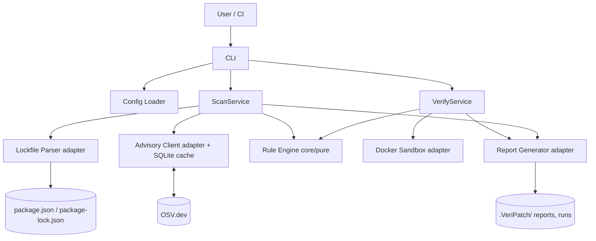
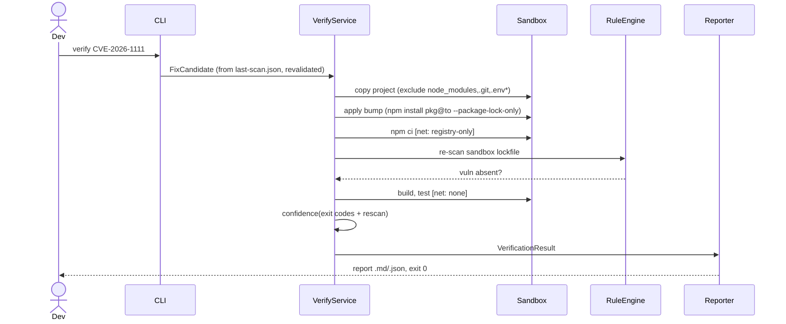

# VeriPatch — Implementation Blueprint v1.0

> Executor: Claude Code. Rule: when ambiguous, this document's decision wins. No implementation code here — types/interfaces/schemas are spec.

---

## 1. Product Specification

### Problem

Detection of vulnerable npm dependencies is commoditized (`npm audit`, Dependabot, Snyk). **Verified remediation is not.** Engineers don't apply fixes because: alert fatigue (40+ findings, no ranking), fear of breakage (SemVer is a promise, not a guarantee), no evidence a fix is safe, no proof the vuln actually left the resolved tree. VeriPatch closes the gap: sandbox-apply the fix, re-scan to prove elimination, run build/tests to prove safety, emit an evidence report.

### Users & Personas

| Persona                            | Trigger                          | Need                                   |
| ---------------------------------- | -------------------------------- | -------------------------------------- |
| P1 Individual dev / OSS maintainer | audit noise, Dependabot PR flood | "What's safe to merge, with proof"     |
| P2 Team lead                       | patch toil eats sprints          | Batch verified fixes, ranked           |
| P3 Security engineer               | compliance backlog               | Audit-grade remediation evidence       |
| P4 CI pipeline (machine)           | every PR / nightly               | JSON report + deterministic exit codes |

### User Stories

- US1: As P1, `VeriPatch scan` shows vulns ranked by severity×feasibility in <15s.
- US2: As P1, `VeriPatch verify <id>` proves a fix is safe (or not) with evidence.
- US3: As P3, I attach `report.json` to a compliance ticket.
- US4: As P4, CI fails on new criticals via exit code 1.
- US5: As P1, I ignore accepted-risk CVEs via `.VeriPatchrc`.
- US6: As P1, `VeriPatch doctor` diagnoses env problems (Docker, lockfile, network).

### Goals / Non-goals

**Goals:** npm/TS ecosystem; scan + deterministic fix resolution + sandboxed verification + evidence reports; CI-ready; zero telemetry; OSS.
**Non-goals (MVP):** auto-PR/auto-merge, multi-language, reachability analysis, SAST, malware detection, yarn/pnpm lockfiles, monorepo workspaces, web UI/SaaS, own CVE mirror.

### Success Metrics

- M1: scan <15s on 1,500-dep project (warm cache).
- M2: verify <10min/vuln.
- M3: verification verdict false-positive rate <2% on fixture corpus.
- M4: ≥90% test coverage on `src/core`.
- M5: 100 GitHub stars / 10 external issue reporters in 90 days post-launch (adoption proxy).

### Scope & Risks

| Risk                                        | Likelihood | Mitigation                                                                          |
| ------------------------------------------- | ---------- | ----------------------------------------------------------------------------------- |
| OSV API instability/rate limits             | M          | SQLite cache TTL 24h, batch endpoint, stale-serve with banner                       |
| Docker unavailable on user machine          | M          | `scan` works without Docker; `doctor` diagnoses; clear exit 2                       |
| SemVer edge cases (0.x, prerelease, `\|\|`) | H          | never hand-roll; `semver` pkg + exhaustive unit fixtures                            |
| Malicious scanned project attacks host      | M          | full sandbox hardening (§9)                                                         |
| False HIGH confidence → user breaks prod    | L/critical | confidence derives only from exit codes + own re-scan; tests-missing caps at MEDIUM |

---

## 2. Technical Specification

### Architecture (ports & adapters; dependency rule: `cli → services → core ← adapters`)



### Core Domain Types (spec — implement in `src/core/models/` with zod schemas)

```ts
type DepNode = {
  name: string;
  version: string;
  paths: string[][];
  dev: boolean;
  direct: boolean;
  integrity?: string;
};
type DepGraph = { nodes: DepNode[]; lockfileVersion: 2 | 3; degraded: boolean };
type Advisory = {
  id: string;
  aliases: string[];
  summary: string;
  severity: { cvss: number; label: 'LOW' | 'MEDIUM' | 'HIGH' | 'CRITICAL' };
  affected: { pkg: string; ranges: string[]; fixed?: string }[];
  references: string[];
  modified: string;
};
type Vuln = { advisory: Advisory; node: DepNode; matchedRange: string };
type FixCandidate = {
  vulnId: string;
  pkg: string;
  from: string;
  to: string;
  bumpType: 'patch' | 'minor' | 'major';
  strategy: 'direct' | 'override' | 'parent-bump';
  feasible: boolean;
  reason?: string;
};
type StepResult = {
  step: 'copy' | 'apply' | 'install' | 'rescan' | 'build' | 'test';
  status: 'pass' | 'fail' | 'skipped' | 'timeout';
  exitCode?: number;
  durationMs: number;
  logTail: string;
  testCounts?: { passed: number; failed: number; total: number };
};
type Confidence = 'HIGH' | 'MEDIUM' | 'FAIL' | 'INCONCLUSIVE';
type VerificationResult = {
  candidate: FixCandidate;
  steps: StepResult[];
  confidence: Confidence;
  residualRisks: string[];
  runId: string;
  startedAt: string;
};
type Result<T> = { ok: true; value: T } | { ok: false; error: AppError };
```

### Error Model

```ts
class AppError {
  kind: 'UserError' | 'WorldError' | 'InternalError';
  code: string;
  message: string;
  hint?: string;
}
```

- UserError (bad config, no lockfile, bad CVE id) → exit 2, message + hint.
- WorldError (network, Docker down) → degrade if honest (stale cache + banner) else exit 2.
- Verification FAIL is **not an error** — `verify` exits 0 with FAIL verdict in report.
- Single exit-code mapper: `src/cli/exit-code.ts`. Codes: 0 clean/success, 1 vulns found (scan) , 2 tool/user error.
- No thrown strings anywhere; all service boundaries return `Result<T>`.

### Logging

- pino, levels debug/info/warn/error; `--verbose` → debug; `--json` → NDJSON to stderr (stdout reserved for machine output).
- Never log env vars, tokens, absolute home paths (redact `~`).
- Sandbox step logs: verbatim to `.VeriPatch/runs/<runId>/<step>.log`; only tail (last 40 lines) + parsed summaries enter reports.

### Configuration (precedence: defaults < .VeriPatchrc < env `VeriPatch_*` < CLI flags)

`.VeriPatchrc` (JSON, zod-validated):

```json
{
  "severityThreshold": "low",
  "ignore": ["CVE-2023-0001"],
  "includeDevDeps": true,
  "testCommand": "npm test",
  "buildCommand": "npm run build",
  "verifyTimeoutMin": 10,
  "sandboxImage": "node:20-slim",
  "cacheTtlHours": 24,
  "reportDir": ".VeriPatch"
}
```

Invalid key → UserError naming exact key. Unknown keys → warn, ignore.

### Data Flow (verify)



Boundary rule: every external input (lockfile, OSV response, config, log text) is zod-validated + string-sanitized (strip ANSI, escape MD) before crossing into core or reports. Confidence computed ONLY from exit codes + own re-scan — never log-text heuristics.

### Confidence Rules (deterministic; implement as pure function `computeConfidence(steps)`)

1. rescan shows vuln present → FAIL (ineffective)
2. install/build/test exitCode ≠ 0 → FAIL (breaking)
3. any timeout → INCONCLUSIVE
4. all pass ∧ test step ran with total>0 → HIGH
5. all pass ∧ tests skipped/absent → MEDIUM

---

## 3. Technology Decisions

| Tech                                                     | Why                                                                 | Alternatives                                   | Trade-off accepted                           |
| -------------------------------------------------------- | ------------------------------------------------------------------- | ---------------------------------------------- | -------------------------------------------- |
| TypeScript 5 strict                                      | typed domain = correctness backbone; dogfood target ecosystem       | Go (static binary), Rust                       | Node runtime needed — users have it          |
| Node 20 LTS                                              | audience stack; `semver`, `@npmcli/*` native                        | Deno/Bun                                       | none material                                |
| commander                                                | mature CLI parsing                                                  | yargs, oclif                                   | oclif heavier than needed                    |
| zod                                                      | runtime boundary validation + inferred types                        | ajv, io-ts                                     | slight perf cost, irrelevant                 |
| semver (pkg)                                             | never hand-roll ranges (0.x, prerelease, `\|\|`)                    | DIY                                            | none — DIY forbidden                         |
| better-sqlite3                                           | sync, fast, single-file cache                                       | node-sqlite3, JSON files                       | native module build; prebuilt binaries OK    |
| pino                                                     | structured, fast logging                                            | winston                                        | —                                            |
| Docker (dockerode client)                                | isolation for untrusted postinstall scripts                         | child_process (forbidden), gVisor (SaaS phase) | kernel-sharing escape risk documented        |
| Vitest                                                   | native TS/ESM, fast, JSON reporter                                  | Jest                                           | —                                            |
| ESLint typescript-eslint strict + `no-floating-promises` | swallowed rejection = false verdict                                 | biome                                          | rule is load-bearing                         |
| Prettier                                                 | zero-debate formatting                                              | biome                                          | —                                            |
| OSV.dev API                                              | ecosystem-native pkg+range mapping, batch endpoint, aggregates GHSA | NVD (awkward CPE), Snyk DB (closed)            | OSV enrichment thinner than NVD — acceptable |
| tsup                                                     | simple bundling for npm publish                                     | esbuild raw, tsc                               | —                                            |
| GitHub Actions                                           | free OSS CI, dogfood                                                | —                                              | —                                            |

---

## 4. Database Design (SQLite cache — `~/.VeriPatch/cache.db`)

```sql
CREATE TABLE advisories_by_pkg (
  pkg_key TEXT PRIMARY KEY,            -- "name@version"
  advisory_ids TEXT NOT NULL,          -- JSON array of OSV ids
  fetched_at INTEGER NOT NULL          -- unix epoch s
);
CREATE TABLE advisories (
  id TEXT PRIMARY KEY,                 -- OSV id e.g. GHSA-... / CVE alias resolved
  json TEXT NOT NULL,                  -- full validated advisory JSON
  modified TEXT NOT NULL,
  fetched_at INTEGER NOT NULL
);
CREATE TABLE meta (k TEXT PRIMARY KEY, v TEXT NOT NULL); -- schema_version=1
CREATE INDEX idx_adv_fetched ON advisories(fetched_at);
```

- TTL: row stale if `now - fetched_at > cacheTtlHours*3600`; stale rows served offline with banner, refreshed when online.
- File perms 0600. Migrations: `meta.schema_version` + ordered SQL files in `src/adapters/cache/migrations/`; run idempotently at open.
- Future (SaaS): Postgres, multi-tenant — out of scope; schema kept portable (no SQLite-only types).

Project-local state (files, not DB): `.VeriPatch/last-scan.json` (schema-versioned scan output), `.VeriPatch/runs/<runId>/` (step logs, applied diff), `.VeriPatch/report-<id>.{md,json}`.

---

## 5. API Specification

MVP has **no HTTP server**. Three API surfaces:

### 5.1 External consumed: OSV.dev

- `POST https://api.osv.dev/v1/querybatch` — body `{queries:[{package:{name,ecosystem:"npm"},version}]}` → `{results:[{vulns?:[{id,modified}]}]}`. Batch ≤1000/call; chunk larger graphs.
- `GET https://api.osv.dev/v1/vulns/{id}` → full advisory. Validate against local zod schema `OsvAdvisorySchema`; on validation failure: drop advisory, warn, count in report as `dataErrors`.
- Errors: 429 → exp backoff (max 3, jitter); 5xx → retry ×2 then WorldError; timeout 10s/call.

### 5.2 Machine output: `report.json` (schemaVersion 1)

```json
{
  "schemaVersion": 1,
  "tool": { "name": "VeriPatch", "version": "x.y.z" },
  "generatedAt": "ISO8601",
  "scan": { "lockfileVersion": 3, "degraded": false, "totalDeps": 1243, "dataErrors": 0 },
  "vulns": [
    {
      "id": "CVE-2026-1111",
      "aliases": ["GHSA-xxxx"],
      "pkg": "axios",
      "installed": "1.5.0",
      "severity": { "cvss": 7.5, "label": "HIGH" },
      "dev": false,
      "paths": [["root", "axios"]],
      "fix": { "to": "1.6.2", "bumpType": "minor", "strategy": "direct", "feasible": true },
      "verification": {
        "runId": "uuid",
        "confidence": "HIGH",
        "steps": [{ "step": "install", "status": "pass", "exitCode": 0, "durationMs": 92000 }],
        "residualRisks": ["..."]
      }
    }
  ],
  "summary": { "critical": 0, "high": 2, "medium": 5, "low": 1, "verified": 1 }
}
```

`verification` null if not yet verified. Fields only added, never removed, within schemaVersion 1.

### 5.3 Internal ports (core-defined interfaces; adapters implement)

```ts
interface AdvisorySource {
  getAdvisories(
    nodes: DepNode[],
  ): Promise<Result<{ advisories: Advisory[]; stale: boolean; dataErrors: number }>>;
}
interface LockfileParser {
  parse(projectDir: string): Result<DepGraph>;
}
interface Sandbox {
  run(plan: SandboxPlan): Promise<Result<StepResult[]>>;
} // SandboxPlan = {projectDir, candidate, config}
interface Reporter {
  write(
    results: ScanOutput | VerificationResult,
    dir: string,
  ): Result<{ mdPath: string; jsonPath: string }>;
}
```

Contract-test suite in `tests/contract/` runs against every implementation of each port.

---

## 6. CLI Specification

Global flags: `--json` (machine output to stdout), `--verbose`, `--config <path>`, `--no-color`, `--cwd <dir>`.

### `VeriPatch scan`

- Flags: `--ci` (exit 1 only if ≥ threshold NEW vulns vs `.VeriPatch/baseline.json` if present, else any), `--dev/--no-dev`, `--severity <min>`.
- Behavior: parse lockfile → advisories (cache-first) → rule engine → write `last-scan.json` → render.
- Output (human): ranked table `ID | SEV | PKG installed→fix | BUMP | STRATEGY | note`, footer summary + `verify` hint. Stale-cache banner if offline.
- Exit: 0 no vulns ≥ threshold; 1 vulns found; 2 error.
- Degraded (no lockfile): parse package.json ranges, banner `⚠ degraded: no lockfile — results incomplete`, verify disabled.

### `VeriPatch verify <vulnId>` | `--all` | `--severity <min>`

- Requires: `last-scan.json` fresh (< 24h, else rerun scan internally), Docker up.
- Behavior: per §2 sequence; `--all` runs serially (MVP), continues on individual FAILs.
- Output: per-vuln step ticker (✅/❌ per step live), final verdict + report paths.
- Exit: 0 verification completed (any verdict); 2 environment/tool error. Never 1.

### `VeriPatch report [vulnId]`

- Re-renders report(s) from stored run artifacts; `--format md|json|pr-comment` (pr-comment = GH-flavored MD with `<details>` log tails).
- Exit: 0; 2 if runId/artifacts missing.

### `VeriPatch doctor`

- Checks: Node ≥20, Docker daemon reachable, sandbox image pullable, lockfile present+version, OSV reachable, cache writable, config valid.
- Output: checklist ✅/❌ + fix hint per failure. Exit 0 all pass; 1 any fail.

### `VeriPatch update`

- Applies a verified fix to the real project: replays the sandbox diff (`npm install pkg@to --package-lock-only`) on the working tree. Refuses if: verification confidence not HIGH/MEDIUM (`--force` overrides with warning), git working tree dirty (`--allow-dirty` overrides).
- Never commits, never pushes. Prints diff summary + suggested commit message.
- Exit: 0 applied; 2 refused/error.

### `VeriPatch cache clear|stats`

- Utility; stats prints row counts + size + staleness histogram.

---

## 7. GitHub Action Design

`action.yml` (composite action wrapping the published CLI):

- Inputs: `severity-threshold` (default high), `fail-on` (new|any, default new), `verify` (bool, default false — verify in CI needs Docker + time), `working-directory`.
- Steps: setup-node@v4 (pinned SHA) → `npm i -g VeriPatch@<pinned>` → `VeriPatch scan --ci --json > pp.json` → annotate (`::warning file=package.json::CVE-... in axios`) → upload `pp.json` artifact → if `verify`: `VeriPatch verify --all --severity critical` + upload run artifacts + sticky PR comment via `--format pr-comment` (needs `pull-requests: write`).
- Permissions block (least privilege): `contents: read`, `pull-requests: write` only when commenting. **No secrets required** (OSV is unauthenticated). GITHUB_TOKEN only for PR comment.
- Triggers (documented example workflow): `pull_request` on `package*.json` paths + weekly `schedule` (catches new advisories on unchanged code — Phase 1 lesson).
- Baseline mode: repo commits `.VeriPatch/baseline.json`; `fail-on: new` diffs against it → no failing builds for pre-existing debt.

---

## 8. Testing Strategy (target: 90%+ on src/core, 80%+ overall)

| Layer       | Scope                                                                                                                                                                                                                       | Tooling              | Notes                                                                                                                                             |
| ----------- | --------------------------------------------------------------------------------------------------------------------------------------------------------------------------------------------------------------------------- | -------------------- | ------------------------------------------------------------------------------------------------------------------------------------------------- |
| Unit        | all `core/` pure functions: semver matching, fix resolution, confidence, sanitizers                                                                                                                                         | Vitest               | table-driven fixtures; every SemVer edge (0.x, prerelease, `\|\|`, `*`); mutation-sensitive: confidence function gets exhaustive truth-table test |
| Contract    | every port implementation vs shared behavioral suite                                                                                                                                                                        | Vitest               | AdvisorySource: real OSV recorded via fixtures (no live net in CI unit lane)                                                                      |
| Integration | parser on real lockfiles (v2, v3, huge, corrupt, hostile), OSV client vs mock server (msw), cache TTL/staleness                                                                                                             | Vitest + msw         | hostile fixtures: `__proto__` keys, 100MB file (size-limit test), traversal names                                                                 |
| E2E         | fixture projects through full scan→verify→update on real Docker                                                                                                                                                             | Vitest, CI-gated job | fixtures: `clean`, `vuln-fixable-minor`, `vuln-major-only`, `vuln-transitive-override`, `no-tests`, `failing-tests-after-patch`, `no-lockfile`    |
| Security    | sandbox hardening asserts: container is non-root, cap-dropped, network=none during test phase (probe attempts must fail); `.env` never present in sandbox copy; ANSI/MD injection through pkg-name → report stays sanitized | E2E lane             | a fixture package with malicious postinstall attempting egress + host write — both must fail                                                      |
| Regression  | every fixed bug adds a fixture/test; verification verdict corpus: recorded expected verdict per fixture, CI diffs                                                                                                           | Vitest               | protects M3 metric                                                                                                                                |

CI matrix: ubuntu (full incl. Docker E2E), macos (unit+integration). Coverage gate in CI: fail <90% core.

---

## 9. Security Architecture

**Assets:** user source code, secrets, verdict integrity, host machine.
**Trust boundaries:** (1) scanned project files [attacker-controlled input], (2) OSV network data, (3) Docker sandbox [untrusted execution].

| Vector                                | Mitigation                                                                                                                                                                                                                                                                                          |
| ------------------------------------- | --------------------------------------------------------------------------------------------------------------------------------------------------------------------------------------------------------------------------------------------------------------------------------------------------- |
| Malicious postinstall in scanned deps | all installs sandboxed: non-root, `--cap-drop=ALL`, `--security-opt=no-new-privileges`, `--pids-limit=512`, mem 2G/cpu 2, `--rm`; network registry-only during install, `--network=none` for rescan/build/test; project **copy** mounted (never original), excludes `.env*`, `.git`, `node_modules` |
| Hostile lockfile/package.json         | size limit (default 50MB) before parse; `JSON.parse` only; null-prototype normalization; name validated vs npm name regex; zod at boundary                                                                                                                                                          |
| Poisoned advisory data                | HTTPS+cert validation; fix candidate MUST be same package name, version-only change — enforced in rule engine; schema validation, invalid advisories dropped+counted                                                                                                                                |
| Dependency confusion                  | `npm ci` enforces lockfile resolved URLs + SRI integrity; missing-integrity entries flagged as findings                                                                                                                                                                                             |
| Report/terminal injection             | strip ANSI + escape MD on every external string pre-render                                                                                                                                                                                                                                          |
| VeriPatch's own chain                 | minimal deps, committed lockfile, Actions pinned by SHA, `npm publish --provenance`, Dependabot on self                                                                                                                                                                                             |
| Privilege                             | refuses to run as root (exit 2); writes only `.VeriPatch/` + `~/.VeriPatch/`; zero telemetry; no secrets handled                                                                                                                                                                                    |
| Verdict integrity                     | confidence from exit codes + own rescan only; documented residual risk: project can fake its own tests' exit 0 — verification claims "project's own checks pass", not "project honest"                                                                                                              |

Secret management: none needed at runtime. Repo CI: only `NPM_TOKEN` for release (GitHub environment-protected, OIDC-preferred trusted publishing).

---

## 10. Milestones

Legend: Diff 1–5. Each milestone = one PR train; commit messages follow Conventional Commits (§14).

**M0 — Repo bootstrap** (Diff 1, deps: none)
Files: package.json, tsconfig, eslint/prettier, vitest.config, .github/workflows/ci.yml, folder skeleton, README stub, LICENSE (Apache-2.0).
Deliverables: `npm run build/test/lint` green in CI on empty skeleton.
Accept: CI green badge; dependency-rule ESLint boundary check (eslint-plugin-boundaries) enforcing `cli→services→core←adapters`.
Commit: `chore: bootstrap repository, toolchain, CI`

**M1 — Core models + config** (Diff 2, deps: M0)
Files: src/core/models/*, src/shared/{config,errors,result,logger}.ts, tests.
Accept: all types + zod schemas; config precedence unit-tested; invalid config → UserError with key name.
Commit: `feat(core): domain models, result type, config loader`

**M2 — Lockfile parser** (Diff 3, deps: M1)
Files: src/adapters/lockfile/*, fixtures (v2, v3, corrupt, hostile, huge), tests.
Accept: DepGraph correct on all fixtures incl. duplicate pkg@versions with paths; degraded mode; hostile inputs rejected safely; contract tests pass.
Commit: `feat(parser): package-lock v2/v3 → DepGraph with degraded mode`

**M3 — Advisory client + cache** (Diff 3, deps: M1)
Files: src/adapters/osv/_, src/adapters/cache/_ (+migrations), msw mocks, tests.
Accept: batch chunking, retry/backoff, TTL, stale-serve offline, dataErrors counting, 0600 perms.
Commit: `feat(advisories): OSV client with SQLite cache and offline stale-serve`

**M4 — Rule engine** (Diff 4, deps: M2, M3)
Files: src/core/rules/{match,severity,fix-resolver}.ts, exhaustive fixtures.
Accept: SemVer edge table green; fix resolution direct/override/parent-bump/feasible:false all covered; same-package-only invariant test.
Commit: `feat(core): vulnerability matching and deterministic fix resolution`

**M5 — scan command** (Diff 2, deps: M4)
Files: src/services/scan.ts, src/cli/{index,commands/scan,exit-code,render}.ts.
Accept: US1 e2e on fixtures; exit codes; `--json`; last-scan.json written; NFR scan<15s (warm) benchmarked in CI.
Commit: `feat(cli): scan command with ranked output and CI mode`

**M6 — Sandbox + verify** (Diff 5, deps: M5)
Files: src/adapters/sandbox/*, src/services/verify.ts, src/core/confidence.ts, cli/commands/verify.ts, security e2e fixtures.
Accept: full pipeline on all e2e fixtures with expected verdicts; hardening asserts pass (egress blocked, non-root, .env absent); timeouts → INCONCLUSIVE; run artifacts persisted.
Commit: `feat(verify): dockerized verification pipeline with deterministic confidence`

**M7 — Reports + update + doctor** (Diff 3, deps: M6)
Files: src/adapters/report/*, cli/commands/{report,update,doctor,cache}.ts.
Accept: report.json matches §5.2 schema (schema test); MD sanitization test; update refusal rules; doctor checks all §6 items.
Commit: `feat(report): evidence reports, safe update apply, doctor diagnostics`

**M8 — GitHub Action + docs + release** (Diff 2, deps: M7)
Files: action.yml, examples/workflow.yml, all §13 docs, release.yml (provenance publish), CHANGELOG via changesets.
Accept: action runs on this repo (dogfood); npm publish dry-run green; docs complete.
Commit: `feat(action): composite GitHub Action, docs, v0.1.0 release pipeline`

---

## 11. Task Breakdown (<2h each)

Format: `ID | Purpose | Files | Output | Validation | Commit`

### M0

- T0.1 | init package.json, tsconfig strict, tsup | package.json,tsconfig.json,tsup.config.ts | building empty entry | `npm run build` ok | `chore: init toolchain`
- T0.2 | eslint(strict+boundaries+no-floating-promises)+prettier | .eslintrc.cjs,.prettierrc | lint runs | seeded violation fails | `chore: lint/format config`
- T0.3 | vitest + coverage gate config | vitest.config.ts | test runner | sample test passes; coverage report emitted | `chore: vitest setup`
- T0.4 | folder skeleton + boundary rule wiring | src/**/.gitkeep | structure per §12 | eslint boundaries: cross-layer import fails | `chore: layered skeleton`
- T0.5 | CI workflow (lint,build,test matrix; docker e2e job gated) | .github/workflows/ci.yml | green CI | push branch, checks pass | `ci: pipeline`
- T0.6 | LICENSE, README stub, CoC | LICENSE,README.md,CODE_OF_CONDUCT.md | docs stubs | render check | `docs: license and readme stub`

### M1

- T1.1 | Result<T> + AppError kinds | src/shared/{result,errors}.ts | types+helpers | unit tests | `feat(shared): result and error model`
- T1.2 | logger (pino, redaction, --json NDJSON) | src/shared/logger.ts | logger factory | redaction test | `feat(shared): structured logger`
- T1.3 | domain types + zod (DepGraph..VerificationResult) | src/core/models/*.ts | schemas exported | round-trip parse tests | `feat(core): domain schemas`
- T1.4 | config loader precedence chain | src/shared/config.ts | typed Config | 4-layer precedence tests; bad-key UserError | `feat(shared): config loader`

### M2

- T2.1 | fixtures: lock v2,v3,corrupt,huge,hostile,no-lock | tests/fixtures/lockfiles/* | corpus | files load | `test: lockfile corpus`
- T2.2 | safe reader (size cap, JSON.parse, null-proto) | src/adapters/lockfile/safe-read.ts | Result<RawLockfile> | hostile+huge rejected | `feat(parser): hardened reader`
- T2.3 | v3 walker → DepNode[] (paths, dev, direct, integrity) | .../v3.ts | graph | fixture assertions incl. dup versions | `feat(parser): v3 walker`
- T2.4 | v2 walker + version dispatch | .../v2.ts,index.ts | graph | v2 fixtures | `feat(parser): v2 support`
- T2.5 | degraded mode (package.json only) | .../degraded.ts | flagged graph | degraded fixture; verify-block flag | `feat(parser): degraded mode`
- T2.6 | LockfileParser contract tests | tests/contract/lockfile.ts | suite | all impls pass | `test: parser contract`

### M3

- T3.1 | OSV zod schemas + sanitizer (ANSI/MD strip) | src/adapters/osv/schema.ts,src/shared/sanitize.ts | validated Advisory | invalid dropped+counted; injection fixtures cleaned | `feat(advisories): schema and sanitizer`
- T3.2 | querybatch client, chunk≤1000, timeout, backoff | .../client.ts | ids per node | msw: 429/5xx/timeout paths | `feat(advisories): batch client`
- T3.3 | detail fetch + merge to Advisory[] | .../client.ts | advisories | msw tests | `feat(advisories): detail hydration`
- T3.4 | sqlite cache: open, migrate, 0600 | src/adapters/cache/db.ts,migrations/001.sql | cache handle | migration idempotency test | `feat(cache): sqlite store`
- T3.5 | cache-first flow + TTL + stale-serve flag | src/adapters/osv/index.ts | AdvisorySource impl | offline stale test; fresh bypass test | `feat(cache): ttl and offline mode`
- T3.6 | AdvisorySource contract tests | tests/contract/advisory.ts | suite | pass | `test: advisory contract`

### M4

- T4.1 | semver range matcher wrapper + edge fixture table | src/core/rules/match.ts | Vuln[] | 0.x, prerelease, `||`, `*` table green | `feat(core): version matching`
- T4.2 | severity scoring + threshold/ignore/dev filters | .../severity.ts | filtered ranked Vuln[] | filter tests | `feat(core): severity ranking`
- T4.3 | fix resolver: first-fixed, bumpType, parent-range check | .../fix-resolver.ts | FixCandidate | direct/override/parent-bump/infeasible fixtures | `feat(core): fix resolution`
- T4.4 | same-package invariant + property tests (fast-check) | tests/unit/core/invariants.test.ts | props | invariant cannot be violated | `test: rule engine invariants`

### M5

- T5.1 | ScanService orchestration | src/services/scan.ts | ScanOutput | integration test w/ mocked ports | `feat(scan): service`
- T5.2 | CLI entry + scan command + flags | src/cli/index.ts,commands/scan.ts | runnable bin | e2e fixture run | `feat(cli): scan command`
- T5.3 | renderer (table, banners, color, --no-color) | src/cli/render.ts | human output | snapshot tests (sanitized) | `feat(cli): scan renderer`
- T5.4 | exit-code mapper + --json + last-scan.json | src/cli/exit-code.ts | contract | exit code matrix test | `feat(cli): exit codes and machine output`
- T5.5 | --ci baseline diff mode | src/services/baseline.ts | new-vs-baseline | baseline fixtures | `feat(scan): ci baseline mode`
- T5.6 | perf bench (1500-dep fixture <15s warm) | tests/bench/scan.bench.ts | benchmark | CI budget check | `test: scan perf budget`

### M6

- T6.1 | sandbox copy step (exclusions, temp dir) | src/adapters/sandbox/copy.ts | staged dir | .env/.git absent test | `feat(sandbox): staging copy`
- T6.2 | dockerode lifecycle: create hardened container, exec, teardown | .../docker.ts | run primitive | flags asserted via inspect | `feat(sandbox): hardened container runtime`
- T6.3 | network phases: registry-only install / none after | .../network.ts | phase switch | egress probe fixture fails | `feat(sandbox): network phases`
- T6.4 | apply-bump step (--package-lock-only) | .../steps/apply.ts | modified staging | diff assertion | `feat(verify): apply step`
- T6.5 | install/build/test steps + timeout kill + log capture + test-count parse (vitest/jest json) | .../steps/*.ts | StepResult[] | per-step fixtures; timeout→INCONCLUSIVE | `feat(verify): pipeline steps`
- T6.6 | rescan step (parser+rules on sandbox lockfile) | .../steps/rescan.ts | present/absent | ineffective-fix fixture → FAIL | `feat(verify): elimination rescan`
- T6.7 | confidence fn (truth table) | src/core/confidence.ts | Confidence | exhaustive table test | `feat(core): confidence computation`
- T6.8 | VerifyService + cli verify + live ticker + run artifacts | src/services/verify.ts,cli/commands/verify.ts | end-to-end | all e2e fixtures expected verdicts | `feat(cli): verify command`
- T6.9 | security e2e: malicious postinstall fixture (egress+host-write attempts) | tests/e2e/security/* | attacks blocked | both attempts fail | `test: sandbox security asserts`

### M7

- T7.1 | report.json writer (schema §5.2) + schema test | src/adapters/report/json.ts | file | zod schema self-test | `feat(report): json evidence report`
- T7.2 | report.md + pr-comment format (sanitized, <details> tails) | .../md.ts | files | injection snapshot tests | `feat(report): markdown and pr-comment`
- T7.3 | report command (re-render from artifacts) | cli/commands/report.ts | output | missing-run UserError | `feat(cli): report command`
- T7.4 | update command (replay diff, refusal rules, dirty-tree check) | cli/commands/update.ts | applied bump | refusal matrix tests | `feat(cli): update command`
- T7.5 | doctor command (checks per §6) | cli/commands/doctor.ts | checklist | each failure simulated | `feat(cli): doctor`
- T7.6 | cache clear/stats | cli/commands/cache.ts | utility | stats snapshot | `feat(cli): cache utils`

### M8

- T8.1 | action.yml composite + example workflow | action.yml,examples/pp.yml | action | dogfood run green | `feat(action): composite action`
- T8.2 | annotations + sticky PR comment path | action steps | PR UX | test repo run | `feat(action): annotations and pr comment`
- T8.3 | docs pass (§13 all files) | docs/*,README.md | complete docs | link check CI | `docs: full documentation set`
- T8.4 | release: changesets, provenance publish, version wiring | .github/workflows/release.yml,.changeset/ | pipeline | dry-run publish | `ci: release pipeline with provenance`
- T8.5 | v0.1.0 cut | CHANGELOG.md | tag+npm | install from npm, doctor+scan smoke | `release: v0.1.0`

---

## 12. Repository Structure

```
VeriPatch/
├── src/
│   ├── cli/               # entry layer: arg parsing, rendering, exit codes ONLY
│   │   ├── index.ts
│   │   ├── commands/      # scan.ts verify.ts report.ts update.ts doctor.ts cache.ts
│   │   ├── render.ts
│   │   └── exit-code.ts   # single 0/1/2 mapping
│   ├── core/              # PURE. No fs/net/docker imports (eslint-enforced)
│   │   ├── models/        # types + zod schemas
│   │   ├── rules/         # match, severity, fix-resolver
│   │   └── confidence.ts
│   ├── services/          # orchestration: scan.ts verify.ts baseline.ts
│   ├── adapters/          # I/O implementations of core ports
│   │   ├── lockfile/      # safe-read, v2, v3, degraded
│   │   ├── osv/           # client, schema
│   │   ├── cache/         # db.ts, migrations/
│   │   ├── sandbox/       # copy, docker, network, steps/
│   │   └── report/        # json.ts md.ts
│   └── shared/            # result, errors, logger, config, sanitize
├── tests/
│   ├── unit/  integration/  e2e/  contract/  bench/
│   └── fixtures/          # lockfiles/, projects/ (clean, vuln-*, no-tests...), osv/
├── docs/                  # §13
│   └── adr/               # 0001-osv-over-nvd.md, 0002-sqlite-cache.md, ...
├── examples/              # workflow.yml, .VeriPatchrc.example
├── .github/workflows/     # ci.yml, release.yml
├── action.yml
└── package.json tsconfig.json vitest.config.ts tsup.config.ts
```

Why each folder: cli=presentation swap-point (future GH App adds sibling entry layer); core=auditable trust logic, ms-fast tests; services=sequencing w/o domain decisions; adapters=replaceable tech; shared=small cross-cutting (fat shared/ = smell, cap it); contract tests keep Liskov across adapters; fixtures are the regression corpus backing metric M3.

---

## 13. Documentation Set

| File                  | Content                                                                                           |
| --------------------- | ------------------------------------------------------------------------------------------------- |
| README.md             | pitch, 90-sec quickstart (install→doctor→scan→verify), badges, demo gif placeholder               |
| docs/ARCHITECTURE.md  | §2 diagrams + dependency rule + data flow                                                         |
| docs/SECURITY.md      | §9 threat model, sandbox guarantees + documented gaps, vuln disclosure policy (security@, 90-day) |
| docs/CLI.md           | §6 full reference incl. exit codes                                                                |
| docs/API.md           | report.json schema, OSV usage, port interfaces                                                    |
| docs/CONFIGURATION.md | .VeriPatchrc reference + precedence                                                               |
| docs/CONTRIBUTING.md  | setup, layering rules, fixture-adding guide, PR checklist                                         |
| docs/ROADMAP.md       | §15                                                                                               |
| docs/adr/*.md         | one per decision (osv, sqlite, docker, advisory-first, vitest…)                                   |
| CHANGELOG.md          | changesets-generated                                                                              |
| CODE_OF_CONDUCT.md    | Contributor Covenant                                                                              |
| SECURITY.md (root)    | pointer to docs/SECURITY.md disclosure section (GitHub convention)                                |

---

## 14. Git Strategy

- **Branching:** trunk-based. `main` protected (CI + 1 review); short-lived `feat/*`, `fix/*`, `chore/*` branches; squash-merge only (linear history).
- **Commits:** Conventional Commits (`feat|fix|chore|docs|test|ci|refactor(scope): msg`); enforced via commitlint CI check. Milestone commit messages as specified in §10/§11.
- **Versioning:** SemVer via changesets. 0.x during MVP (breaking allowed in minor, documented); 1.0.0 when report schemaVersion + CLI contract declared stable (post-M8 + 30 days field feedback).
- **Releases:** changesets bot PR → merge → tag `vX.Y.Z` → release.yml: build, test, `npm publish --provenance` (OIDC trusted publishing), GitHub Release with CHANGELOG excerpt. Action consumers pin by SHA/tag.

---

## 15. Future Roadmap

**Phase 2 (v1.x):** yarn/pnpm lockfile adapters; npm workspaces/monorepo; parallel verify with job pool; richer overrides strategies; baseline management UX.
**Phase 3:** reachability analysis (ts-morph call graph → priority downgrade for unreachable vuln fns — activates deferred ADR); verification verdict corpus published as public benchmark.
**GitHub App:** webhook server + verify queue; mandatory sandbox upgrade to gVisor/Firecracker (untrusted repos at scale); sticky PR evidence comments; org dashboard seed.
**VS Code Extension:** inline diagnostics on package.json; "verify" code-action invoking local CLI; reuses core as library.
**AI Assistant:** LLM changelog-delta summaries, CVE-in-context explanations, residual-risk drafting. Invariant: **AI explains, never decides** — confidence stays deterministic. Explanation quality eval-tested (promptfoo suite).
**Auto-PR:** gated on measured false-positive rate <1%, calibration validated, HIGH-only, per-repo opt-in.
**SaaS/Enterprise:** hosted verification, Postgres multi-tenant, SSO/audit logs, SLA/compliance reports, priority queues. Open-core: CLI free forever.

---

_End of blueprint. Executor: proceed M0→M8 in order; each task's Validation is its definition of done._
