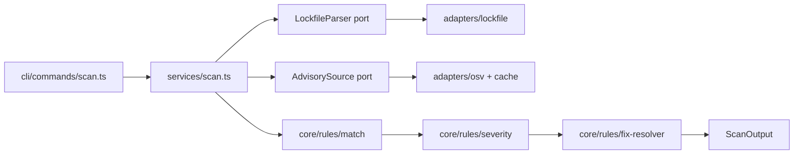
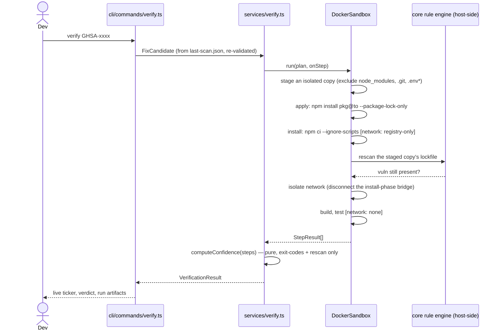

# Architecture

## Dependency rule

```
cli → services → core ← adapters
              ↖ shared ↗
```

- **`core/`** is pure: domain models (zod schemas), rule engine (semver matching, severity
  ranking, fix resolution), confidence computation. No filesystem, network, or process
  imports — enforced by an ESLint rule (`no-restricted-imports` on `fs`/`http`/`child_process`/
  `dockerode` inside `src/core/`). `core/` also defines the **ports** every adapter implements:
  `LockfileParser`, `AdvisorySource`, `Sandbox`, `Reporter`.
- **`adapters/`** implement those ports against real I/O: the npm lockfile parser, the OSV.dev
  client + SQLite cache, the Docker sandbox, the JSON/Markdown reporters. Adapters may import
  `core` (to implement its ports and reuse its rules) and `shared`, never `services` or `cli`.
- **`services/`** orchestrate a use case (`scan`, `verify`, baseline diffing, report merging)
  against the _port interfaces_, not concrete adapters. A service never imports
  `dockerode`, `better-sqlite3`, or `fs` directly.
- **`cli/`** is the composition root: it constructs concrete adapters, injects them into
  services, and owns argument parsing, exit codes, and rendering. Nothing outside `cli/`
  calls `process.exit` or reads `process.argv`.
- **`shared/`** is small and one-directional (`Result<T>`, `AppError`, the logger, config
  loader, sanitizer). Everything is allowed to depend on it; it depends on nothing else in
  `src/`.

A layer-boundary violation (e.g. `core/` importing `fs`, or `services/` importing an adapter
directly) fails the build via `eslint-plugin-boundaries` + the `no-restricted-imports` rule in
`eslint.config.js` — this is checked in CI, not just convention.

## Data flow: `scan`



Parse the lockfile into a `DepGraph` → fetch advisories (cache-first, TTL, offline
stale-serve) → match installed versions against advisory ranges → rank by severity, filtering
ignored/dev-excluded vulns → resolve a deterministic fix candidate per vuln → write
`last-scan.json` and render.

## Data flow: `verify`



Each step's full output is sanitized (ANSI stripped) and truncated to its last 40 lines before
entering a `StepResult`; that's the only log data that ever reaches a report.

## Confidence: the one rule that matters

`core/confidence.ts` computes the verdict from **exit codes and the rescan result alone** —
never from parsing log text for words like "success". In priority order:

1. rescan shows the vuln still present → **FAIL** (the fix didn't work)
2. install/build/test exited non-zero → **FAIL** (the fix broke something)
3. any step timed out → **INCONCLUSIVE**
4. everything passed and real tests ran (`total > 0`) → **HIGH**
5. everything passed but no tests ran → **MEDIUM**

Test _pass/fail_ is always exit-code-only. Parsing a test runner's reporter output (Jest/Vitest
JSON or their default summary line) only decides the HIGH-vs-MEDIUM split — never pass/fail
itself. This is deliberate: a project can't talk its way into a HIGH verdict by printing
reassuring text.

## Sandbox hardening

The Docker sandbox (`adapters/sandbox/`) runs as a non-root user (`1000:1000`), all Linux
capabilities dropped, `no-new-privileges`, pid/memory/cpu limits, and mounts a **staged copy**
of the project — never the original tree, and never `.git`/`.env*`/`node_modules`. Network is
phased: a dedicated per-run bridge network during `install`, fully disconnected before
`build`/`test`. Because that network boundary constrains _which network_ the container is on
rather than _which domains_ it can reach, the primary defense against a malicious `postinstall`
script is `npm ci --ignore-scripts` — the script never runs at all, regardless of what network
access exists at that point. See [docs/SECURITY.md](docs/SECURITY.md) for the full threat model
and documented residual risks.

## Repository layout

```
src/
├── cli/               entry, commands/, render.ts, exit-code.ts
├── core/               pure: models/, rules/, confidence.ts, ports.ts
├── services/           orchestration: scan.ts, verify.ts, baseline.ts, report.ts
├── adapters/
│   ├── lockfile/        package-lock.json v2/v3 → DepGraph, degraded mode
│   ├── osv/             OSV.dev client, schema, cache-backed AdvisorySource
│   ├── cache/           SQLite advisory cache + migrations
│   ├── sandbox/         Docker lifecycle, network phases, pipeline steps
│   └── report/          JSON/Markdown/pr-comment writers
└── shared/              Result, AppError, logger, config, sanitize, version
tests/
├── unit/                mirrors src/, one file per module
├── integration/         real fixtures, mocked network (msw)
├── contract/            one behavioral suite per port, run against every adapter
├── e2e/security/        real-Docker hardening asserts (self-skips without a daemon)
└── bench/               perf budget for the pure rule-engine pipeline
```
